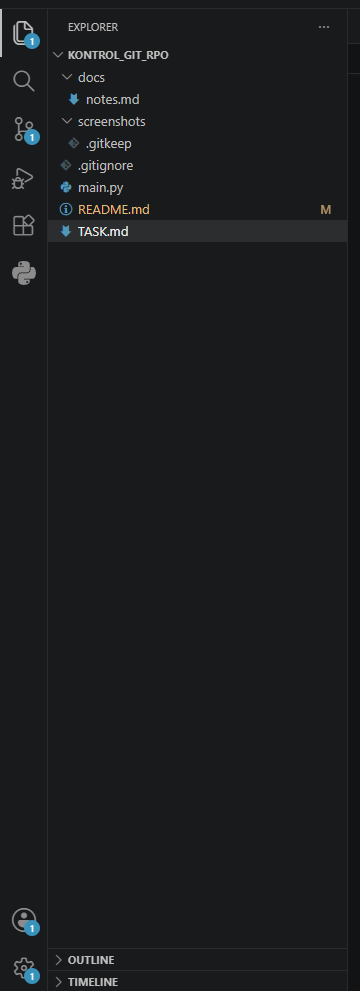
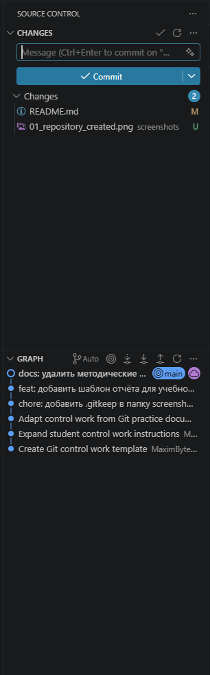
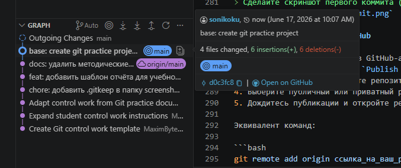
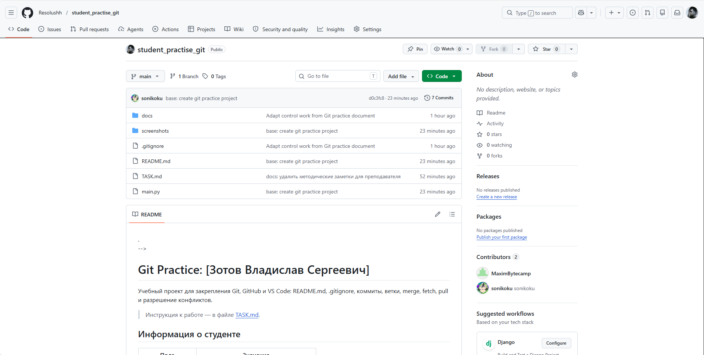
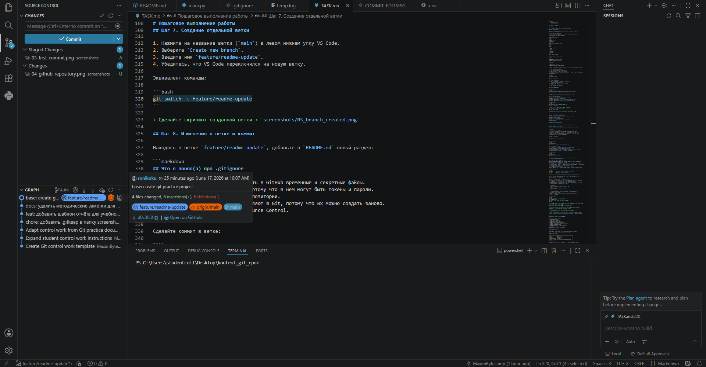
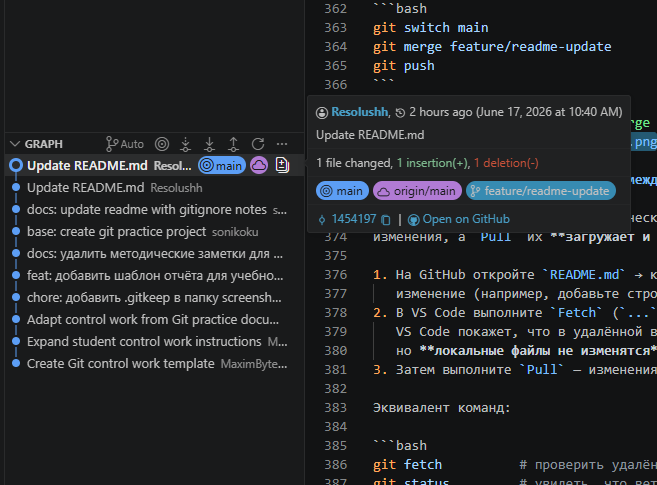
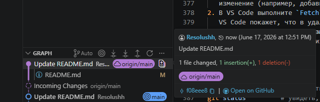
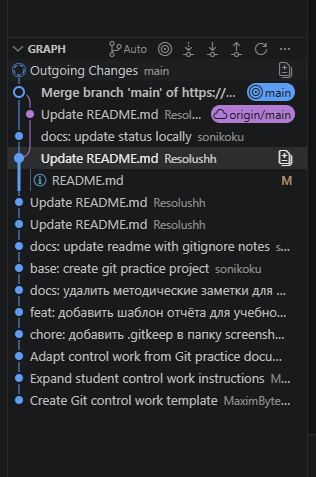

<!--
Это ШАБЛОН ОТЧЁТА. Заполните его своими данными по ходу работы.
Само задание со всеми шагами находится в файле TASK.md — его менять не нужно.
Заменяйте текст в [квадратных скобках] своими данными и удаляйте подсказки в <!-- ... -->.
-->

# Git Practice: [Зотов Владислав Сергеевич]

Учебный проект для закрепления Git, GitHub и VS Code: README.md, .gitignore,
коммиты, ветки, merge, fetch, pull и разрешение конфликтов.

> Инструкция к работе — в файле [TASK.md](TASK.md).

## Информация о студенте

| Поле             | Значение                                           |
|------------------|-----------------------------------------           |
| ФИО              | [Зотов Владислав Сергеевич]                        |
| Группа           | [РПО 9/1]                                          |
| Дисциплина       | Git и GitHub                                       |
| Дата выполнения  | [17.06.2026]                                       |
| Ссылка на GitHub | [https://github.com/Resolushh/student_practise_git]|

## Цель работы

Закрепить полный цикл работы с Git и GitHub через графический интерфейс VS Code.

## Описание выполненных этапов

1. Клонирование шаблона из GitHub через Git: Clone в VS Code.
2. Проверка Git-репозитория — VS Code определил ветку main.
3. Создание структуры проекта (main.py, README.md, .gitignore, docs/notes.md, screenshots/).
4. Настройка .gitignore — исключил .env, *.log, venv/, pycache/.
5. Первый коммит — base: create git practice project.
6. Публикация на GitHub через Publish Branch.
7. Создание ветки feature/readme-update и коммит с изменениями.
8. Merge ветки в main и отправка на GitHub.
9. Fetch и Pull — увидел разницу: Fetch проверяет изменения, Pull применяет их.
10. Разрешение конфликта в README.md через редактор VS Code.
11. Оформление отчёта в README.md со скриншотами.

## Использованные Git-действия

- Clone Repository
- Initialize Repository
- Stage Changes
- Commit
- Publish Branch
- Push / Sync Changes
- Fetch
- Pull
- Create Branch / Switch Branch
- Merge
- Resolve Conflict
- Git Graph

## Таблица Git-действий и их смысла

| Действие              | Где в VS Code                     | Смысл                                                   |
|-----------------------|-----------------------------------|---------------------------------------------------------|
| Clone Repository      | Command Palette → `Git: Clone`    | Копирует репозиторий с GitHub на компьютер              |
| Initialize Repository | Source Control                    | Создаёт локальный Git-репозиторий                       |
| Stage Changes         | Source Control, кнопка `+`        | Подготавливает файлы к коммиту                          |
| Commit                | Поле `Message` + кнопка `Commit`  | Сохраняет версию проекта в истории                      |
| Publish Branch        | Source Control                    | Публикует проект/ветку на GitHub                        |
| Push / Sync Changes   | Source Control                    | Отправляет и синхронизирует коммиты с GitHub            |
| Fetch                 | Source Control → `...` → `Fetch`  | Проверяет изменения на GitHub, не меняя локальные файлы |
| Pull                  | Source Control → `...` → `Pull`   | Загружает и применяет изменения с GitHub                |
| Create / Switch Branch| Панель снизу слева, Git Graph     | Создаёт и переключает ветки                             |
| Merge                 | Git Graph / Command Palette       | Объединяет изменения одной ветки с другой               |
| Resolve Conflict      | Редактор VS Code                  | Выбор или объединение конфликтующих изменений           |
| Git Graph             | Расширение Git Graph              | Показывает историю коммитов и веток                     |

## Разница между Fetch и Pull

Fetch - только просмотр изменений на удаленном репозитории, Pull - применение изменений

## Конфликт и его решение

Создал искусственный конфликт в тексте README.md, решил сохранив исходящее значение

## Скриншоты выполнения работы

### 1. Созданный проект в VS Code

### 2. Инициализированный репозиторий

### 3. Первый коммит

### 4. Репозиторий на GitHub

### 5. Созданная ветка

### 6. Результат merge

### 7. Выполнение Fetch / Pull

### 8. Итоговая история в Git Graph

## Вывод

В ходе выполнения контрольной работы я полностью освоил практический цикл работы с Git и GitHub через графический интерфейс VS Code. Научился клонировать репозитории, создавать коммиты, настраивать .gitignore, публиковать проекты на GitHub, работать с ветками и выполнять их слияние. Освоил разницу между Fetch (проверка удалённых изменений без применения) и Pull (загрузка и применение изменений), а также приобрёл навык разрешения конфликтов в редакторе VS Code. Закрепил умение оформлять техническую документацию в Markdown и визуализировать историю через Git Graph. Полученные навыки позволяют эффективно работать как индивидуально, так и в команде, обеспечивая контроль версий и совместную разработку проектов.

## Что я понял(а) про .gitignore

- `.gitignore` помогает не отправлять в GitHub временные и секретные файлы.
- Файл `.env` нельзя публиковать, потому что в нём могут быть токены и пароли.
- Логи `*.log` обычно не нужны в репозитории.
- Папки `venv/` и `.venv/` не добавляют в Git, потому что их можно создать заново.
- Перед коммитом нужно проверять Source Control.

